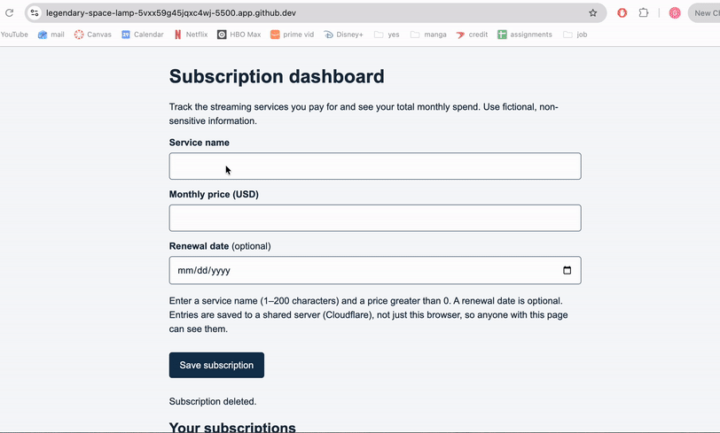
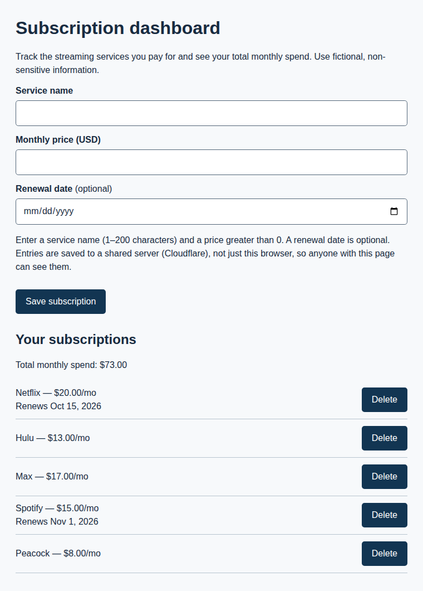
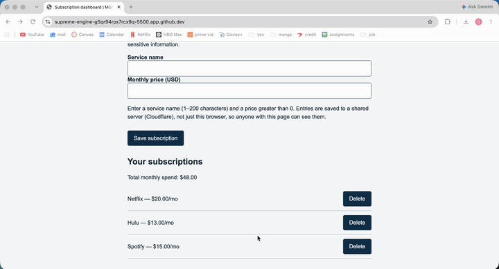
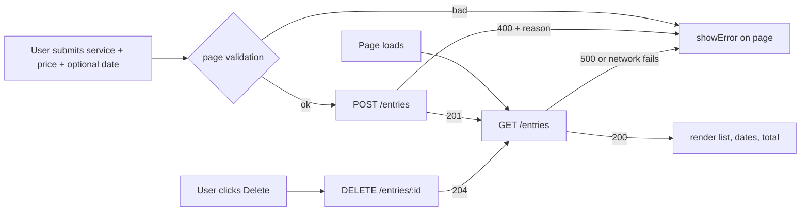
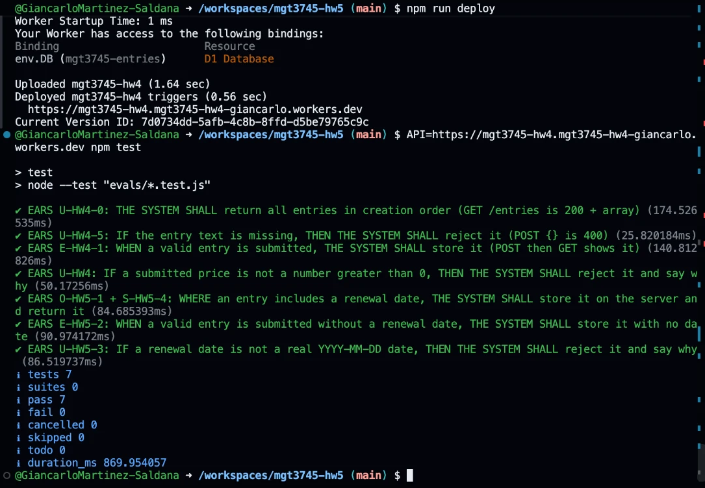

# Cost Tracker: The First Delegated Feature

## What

HW4 repository: [GiancarloMartinez-Saldana/mgt3745-hw4](https://github.com/GiancarloMartinez-Saldana/mgt3745-hw4)

People who stream lose track of what they pay for. Both people I interviewed
guessed their subscription count too low ([PROJECT.md](context/PROJECT.md),
[USERS.md](context/USERS.md)). This page is a subscription dashboard
(F-01/F-05 in [FEATURES.md](context/FEATURES.md)). You enter each service and
its monthly price, and it keeps a running monthly total. **HW5 delegates one
feature: an optional renewal date shown next to each service.** It's HW3
statement #5, which was marked FAIL in HW3 and HW4 because it was never built.
Entries live in Cloudflare D1 behind a small Worker, so they survive a cleared
cache and show up in any browser. The renewal date is stored there too, not in
the browser
([ADR-002](context/ARCHITECTURE.md#adr-002-entries-move-from-localstorage-to-cloudflare-d1)).

## See It Work

The renewal date on the live page (HW5): a subscription saved with a renewal
date shows "Renews …" under it and is still there after a reload, because the
date comes back from the Worker, not the browser.



A still of the same feature: Netflix and Spotify were saved with a date, and
the others without one. The page was served on `127.0.0.1:5500` against the local
Worker:



Surviving a cleared cache (HW4, deployed). Three subscriptions are saved, site
data is cleared, the page reloads, and all three come back from the server:





## How to Run

Deployed: <https://mgt3745-hw4.mgt3745-hw4-giancarlo.workers.dev/entries>. It returns `[]` or a list of entries, never an error.

From a fresh Codespace:

1. Open the repository in a Codespace. The devcontainer installs xdg-utils and runs `npm install`.
2. `npx wrangler login --device`. The database from HW4 already exists (its id is in `wrangler.toml`), so you don't create it again.
3. **HW5, once, in this order:** `npm run db:migrate` adds the `renewal_date` column to the existing table. Then add this Codespace's Live Server origin (Ports tab, port 5500, like `https://<codespace-name>-5500.app.github.dev`) to `ALLOWED_ORIGINS` in `worker.js`. Then run `npm run deploy`. If you deploy before migrating, every save returns a 500.
4. Right-click `index.html` and choose **Open with Live Server**. A page served from `localhost` or `127.0.0.1` talks to `npm run dev` instead of the deployed Worker.

Run the code eval (7 tests; it deletes what it creates):

```bash
API=https://mgt3745-hw4.mgt3745-hw4-giancarlo.workers.dev npm test
```



The same run against the Worker on `npm run dev` before deploying is in [docs/npm-test-local.png](docs/npm-test-local.png).

To run everything locally instead: `npx wrangler d1 execute mgt3745-entries --local --file=schema.sql`, then `npm run dev` (port 8787), then `API=http://127.0.0.1:8787 npm test`. Add `?serverDown` to the page URL to test the outage message.

## Status

**Pass count (EVALS.md):** `npm test` 7 of 7 against the deployed Worker; the
four HW5 rows 4 of 4 on the deployed page; judgment eval 12 of 12 agreement.

| Feature | EARS statement | Verdict |
|---|---|---|
| **Renewal date shown (HW5)** | WHERE a subscription entry includes a renewal date, THE SYSTEM SHALL display that date alongside the service | PASS, was FAIL in HW3/HW4 |
| **No date still saves (HW5)** | WHEN a valid subscription is submitted without a renewal date, THE SYSTEM SHALL store it and show it with no date | PASS |
| **Bad date rejected (HW5)** | IF a submitted renewal date is not a real calendar date in YYYY-MM-DD form, THEN THE SYSTEM SHALL reject the entry and say why | PASS |
| **Date on the server (HW5)** | THE SYSTEM SHALL store the renewal date on the server with the rest of the entry | PASS |
| Save a subscription | WHEN a valid subscription is submitted, THE SYSTEM SHALL store it on the server and confirm it on the page | PASS |
| Reject a bad price | IF a submitted price is not a number greater than 0, THEN THE SYSTEM SHALL reject it and say why | PASS |
| Reject a bad name | IF the service name is missing, empty, or longer than 200 characters, THEN THE SYSTEM SHALL reject it and say why | PASS |
| Survive cleared cache | THE SYSTEM SHALL return stored subscriptions to any browser, including one whose site data was cleared | PASS |
| Delete updates total | WHEN the user removes a subscription, THE SYSTEM SHALL delete it on the server so the total no longer includes it | PASS |
| Network down / 500 / 400 | IF the server can't be reached or returns an error, THEN THE SYSTEM SHALL tell the user on the page | PASS |
| Two clients, one table | Private per-user lists | DEFERRED (ADR-002 → ADR-003) |

The HW5 rows pass `npm test` against the deployed Worker (October 2, 2026,
after `npm run db:migrate` and `npm run deploy`; screenshot above). I then walked
the page by hand on the deployed Worker: an entry saved with a date showed
"Renews …", and still did after a reload.
The full tables are in [FEATURES.md → HW5: Verification](context/FEATURES.md#hw5-verification)
and [HW4: Verification](context/FEATURES.md#hw4-verification). The evals and
the error-analysis log are in [EVALS.md](context/EVALS.md).

## Delegation

- [DDR-001](docs/DDR-001.md): renewal date (F-05), bolt.new and Google AI Studio, Session B. bolt's output is the base of the shipped page files; each fix is a numbered Finding and its own commit. Net hours: −2 (neither output kept)
- [DDR-002](docs/DDR-002.md): the HW4 delegation, written up. It was Claude Code, not Copilot; the DDR explains why.
- [DDR-003](docs/DDR-003.md): renewal date integrated into the real app with Claude Code. Net hours: +5
- [Comparison note](docs/COMPARISON.md), [checklist](docs/CHECKLIST.md), [judgment eval](docs/JUDGMENT.md)
- What the tools were given: [delegated/PASTE.md](delegated/PASTE.md). What they returned: `delegated/*.zip`.

## Links

- HW4 repository (as submitted): <https://github.com/GiancarloMartinez-Saldana/mgt3745-hw4>
- Deployed Worker: <https://mgt3745-hw4.mgt3745-hw4-giancarlo.workers.dev/entries>

Reading order for a stranger: [PROJECT.md](context/PROJECT.md) →
[USERS.md](context/USERS.md) → [FEATURES.md](context/FEATURES.md) →
[ARCHITECTURE.md](context/ARCHITECTURE.md) → [STANDARDS.md](context/STANDARDS.md) →
[TOOLS.md](context/TOOLS.md) → [STYLE.md](context/STYLE.md) →
[EVALS.md](context/EVALS.md) → [SKILLS.md](context/SKILLS.md) → [CLAUDE.md](context/CLAUDE.md)

## AI Use

Every delegation has a DDR under Delegation above. Session B (bolt.new and AI
Studio) is DDR-001. The integration, the evals, and the first drafts of the
HW5 context files and docs were done by Claude Code (DDR-003). It ran the
tests and a browser walk itself, and the commits show what it changed. I
reviewed the diff and filled the "You" column of [JUDGMENT.md](docs/JUDGMENT.md)
without looking at its answers.

**Stake timing:** the RAT and Prediction Stake in EVALS.md were written after
Session B, not in class: drafted by Claude Code, reviewed by me, and committed
October 1 at 3:59 PM ET, before bolt.new ran (4:21 PM) and before either zip
was committed (8:16 PM and 8:31 PM).

Hours spent on this assignment: 9.
